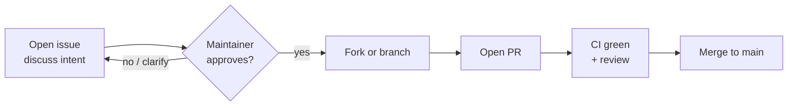

# Contributing to gcalpod

Thanks for considering a contribution. Starting with **v1.0.0**,
all changes to `main` go through open issues and pull requests
(`PR/Issue gate`). Direct pushes to `main` are blocked.

## Workflow



## Step-by-step

1. **Open an issue first** for anything beyond a typo or trivial doc
   fix. Describe the intent, the use case, and a sketch of the
   change. Wait for maintainer ack before coding.
2. **Fork** the repository (`podarok/gcalpod`) on GitHub.
3. **Create a feature branch** off `main`:
   ```sh
   git checkout -b feat/<short-description>
   ```
4. **Match the code style**:
   ```sh
   cargo fmt --all
   cargo clippy --all-targets -- -D warnings
   cargo test --all
   ```
5. **Conventional Commits** for subjects:
   - `feat(area): summary`
   - `fix(area): summary`
   - `docs(area): summary`
   - `refactor(area): summary`
   - `test(area): summary`
   - `chore(...): summary`
6. **No AI-credit trailers.** No `Co-authored-by: Claude`. No
   `Generated with Claude Code` footers. Owner preference (NDA).
7. **Open a PR** against `main`. Reference the issue
   (`Closes #N` / `Refs #N`).
8. **Pass CI**: `cargo build`, `cargo test`, `cargo clippy`,
   `cargo fmt --check`. PRs cannot merge until green.
9. **Address review** rounds. Squash on request; default merge
   strategy is "merge commit" (no squash by project policy unless
   explicitly approved).
10. **Wait for maintainer approval** before merge. Self-merge is
    blocked.

## What gets accepted fast

- Bug fixes with a regression test.
- Documentation improvements (README, docs/, CHANGELOG).
- Test coverage increases (no behaviour change).
- New `--format` outputs that follow the v1 schema.
- Translations / docs in additional languages under `docs/i18n/`.

## What needs more discussion

- Behaviour changes to existing commands → open issue + design
  options first (Option A/B/C pattern).
- New top-level subcommands → owner gate.
- New dependencies → justify in the PR description.
- Schema changes (`--format json|tsv|csv` columns) → bump major
  version.

## What is rejected

- Closed-source forks reusing `gcalpod` name (per
  [`LICENSE-ADDENDUM.md`](LICENSE-ADDENDUM.md)).
- Removing the upstream attribution (`NOTICE.md`,
  `LICENSE-Apache-2.0`).
- AI co-author trailers / "Generated with X" footers.
- Force-pushing to shared branches without prior owner ok.

## License of contributions

By submitting a contribution you agree that it is licensed under
[`LICENSE`](LICENSE) (PolyForm Noncommercial 1.0.0) **plus**
[`LICENSE-ADDENDUM.md`](LICENSE-ADDENDUM.md) (gSL-v1). In return
you receive **automatic commercial-use rights** as long as your
commits remain in `main` (Addendum E — Contribution Grant).

No CLA is required.

## Disclosure: security issues

Do **not** open a public issue for vulnerabilities. Email the
maintainer via the GitHub Sponsors profile, or post a private
[Security advisory](https://github.com/podarok/gcalpod/security/advisories/new).

## Local pre-flight

```sh
cargo fmt --all -- --check
cargo clippy --all-targets --all-features -- -D warnings
cargo test --all
cargo run --release -- --help
```

All four must pass before pushing.

## Asking for help

- Open a [Discussion](https://github.com/podarok/gcalpod/discussions)
  (preferred for ideas, design, questions).
- Open an [Issue](https://github.com/podarok/gcalpod/issues) for
  bugs and feature requests.
- Sponsor at any tier on [GitHub Sponsors](https://github.com/sponsors/podarok)
  to support maintenance and unlock commercial-use rights via
  Addendum A.

## Code of conduct

Be kind. No harassment. No personal attacks. Maintainers reserve
the right to remove any comment, commit, or branch that violates
these norms.
