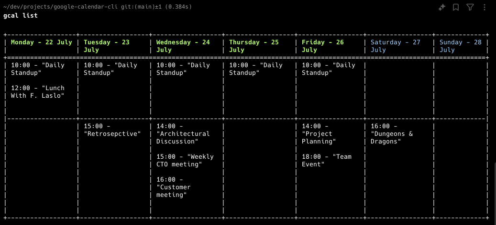

# gcalpod — Google Calendar CLI


`gcalpod` is a Rust command-line interface for Google Calendar. The
binary is invoked as `gcal`; the package + repository name is
`gcalpod`. Add events, list events, manage multiple profiles — all
without leaving your terminal.

> Derivative of [`rust-dd/google-calendar-cli`](https://github.com/rust-dd/google-calendar-cli).
> Apache 2.0 license preserved. Substantial modifications listed in
> [`NOTICE.md`](NOTICE.md). Active work plan in [`queue/`](queue/).

*Note: Early-stage project. Many features still in development. See
[`queue/INDEX.md`](queue/INDEX.md) for the current roadmap.*



Happy scheduling!

***

## Installation

```sh
git clone git@github.com:podarok/gcalpod.git
cd gcalpod
cargo build --release && cargo install --path . --locked
```

After install, the binary is `gcal` (in `~/.cargo/bin/gcal`).

## Usage


### Help Command

To view available commands and options, use:


```sh
gcal help
```

### Example Commands

Here are some example commands to help you get started:


| Description                          | Command                                          |
|--------------------------------------|--------------------------------------------------|
| Quick event for today                | `gcal "Retro & Demo at 16:00"`                   |
| Quick event on a specific date       | `gcal "Appointment on June 3rd 10am-10:25am"`    |
| Add event specifying only the time   | `gcal "Appointment" "10:25"`                     |
| Add event with month and day         | `gcal "Appointment" "07-13 23:25"`               |
| Add event with full date and time    | `gcal add "Appointment" "2024-07-12 10:25"`      |
| Add event with conference meeting    | `gcal "Appointment" "23:45" --conference`        |
| List events                          | `gcal list`                                      |


## Authentication

`gcal` requires you to configure your own Google Cloud OAuth client.
There is no shared / built-in fallback — every user creates their
own OAuth project (it takes ~5 minutes and is free for personal use).

### Configuring your OAuth project

`gcal` resolves credentials in this order:

1. `GCAL_CLIENT_ID` + `GCAL_CLIENT_SECRET` env vars (optional `GCAL_PROJECT_ID`).
2. `GCAL_SECRET_FILE` env var pointing to a JSON file.
3. `~/.gcal/secret.json` (default file path).

If none are configured, `gcal` errors with a setup pointer.

Set `GCAL_VERBOSE=1` to print which source was used.

Step-by-step Google Cloud Console setup is in [docs/custom_auth.md](docs/custom_auth.md).

### Authentication Process

1. Run any gcal command; the authentication process will start automatically.
2. Follow the on-screen instructions to complete the authentication.
3. The authentication token will be saved to ~/.gcal/store.json for future use.


## Development

For developers looking to contribute or experiment with gcal, you can run the project directly from the source:


```sh
cargo run -- list
```

This command will compile and run the gcal tool, allowing you to list events or perform other tasks directly from your development environment.
